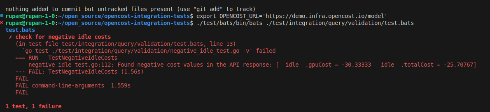

# OpenCost Negative Idle Costs Integration Test

## Overview
This integration test detects negative cost values in the OpenCost allocation API response, specifically focusing on idle costs. Negative cost values are a bug that should be caught and reported.

## Problem Statement
When examining the OpenCost demo at https://demo.infra.opencost.io/?window=1d&agg=namespace, I observed negative values in the idle entry. This is a bug that needs to be caught via an integration test.

## Implementation Steps

### 1. Explored the API and Issue
- Identified the relevant API endpoint by examining network calls on the demo site
- Found the endpoint: `/allocation/compute` with parameters `window=1d`, `aggregate=namespace`, `includeIdle=true`, `step=1d`, `accumulate=false`
- Confirmed the issue by examining the response, which showed negative values for `__idle__.gpuCost` (-30) and `__idle__.totalCost` (-25.42189)

### 2. Created Test Files
- Created directory structure: `test/integration/query/validation/`
- Created Go test file: [`negative_idle_test.go`](link-to-github-file) - implements test logic to check for negative costs
- Created BATS test file: [`test.bats`](link-to-github-file) - runs the Go test

### 3. Test Structure
The test performs the following:
- Calls the OpenCost allocation API with appropriate parameters
- Parses the JSON response
- Checks cost fields (cpuCost, ramCost, gpuCost, totalCost) for negative values
- Fails the test if any negative values are found, reporting which fields contain negative values

### 4. Running the Test
```bash
# Set the environment variable to point to the OpenCost instance
export OPENCOST_URL='https://demo.infra.opencost.io/model'

# Run the test
./test/bats/bin/bats ./test/integration/query/validation/test.bats

Based on the sample JSON you provided, it should find negative values for __idle__.gpuCost and __idle__.totalCost, which will cause the test to fail.